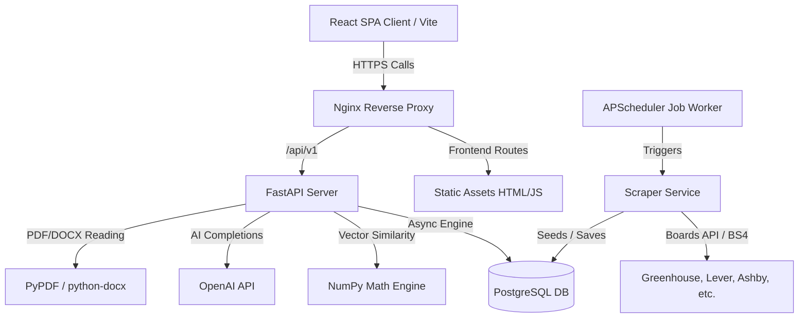
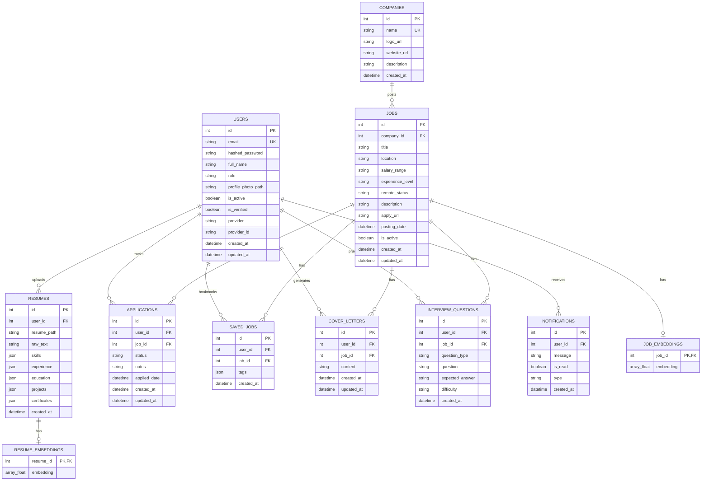

# AI Job Finder

AI Job Finder is a production-grade, automated SaaS application designed to scale and optimize software engineering job applications. It automatically crawls connected boards (Greenhouse, Lever, Ashby, Company portals), parses PDF/DOCX resume nodes using AI, computes ATS match scores using dense vector similarities, generates customizable cover letters/summaries, compiles technical question prep sheets, and tracks active funnels on a Kanban interface.

---

## System Architecture



---

## Entity-Relationship (ER) Diagram



---

## Installation & Developer Quickstart

### Prerequisites
- [Docker & Docker Compose](https://docs.docker.com/get-docker/) installed.

### Local Execution (Docker Compose)
To compile and boot the entire stack (PostgreSQL, FastAPI Backend, React Frontend served via Nginx) simply execute:

```bash
docker compose up --build
```

The services will initialize:
- **Web App Interface**: Visit [http://localhost](http://localhost)
- **FastAPI Interactive Docs**: Visit [http://localhost:8000/docs](http://localhost:8000/docs) (Swagger)
- **PostgreSQL Database**: Port `5432`

---

## Configuration Variables (.env)
Copy the `.env.example` file and configure your details:

```bash
cp .env.example .env
```

| Key | Description | Default |
|-----|-------------|---------|
| `SECRET_KEY` | JWT Signing key | `supersecretjwtkey...` |
| `DATABASE_URL` | Database Connection string | `postgresql+asyncpg://...` |
| `OPENAI_API_KEY` | OpenAI completion key (optional, falls back to local vector matching if blank) | `""` |

---

## API Documentation (OpenAPI)
The backend is powered by FastAPI and generates standard OpenAPI 3.0 documentation.
Once running, navigate to:
- **Swagger UI**: [http://localhost:8000/docs](http://localhost:8000/docs)
- **ReDoc**: [http://localhost:8000/redoc](http://localhost:8000/redoc)

---

## Production Deployment Guide

1. **Proxy & SSL Routing**:
   Ensure port `80` and `443` are open on the hosting gateway. The included Nginx configurations serve standard fallback paths for React Router routing support.
2. **Database Engine Migrations**:
   Alembic is configured to run automatically on server boot (`app/core/database_utils.py`), removing manual startup command locks.
3. **Environment Security**:
   Ensure `SECRET_KEY` and `OPENAI_API_KEY` are injected via secure runtime secret managers rather than committed inside files.
